# class 7 (12/13/25) - Saturday
### week 15: S3 & CloudFront via console

### goal = Use console to distribute S3 bucket content via CloudFront

### Deliverables = links of functional CloudFront-hosted webpages (index and error)

###########################################

# S3 & CloudFront

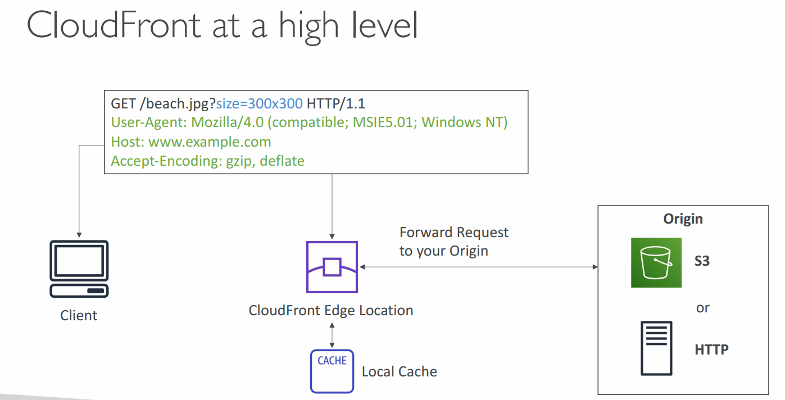

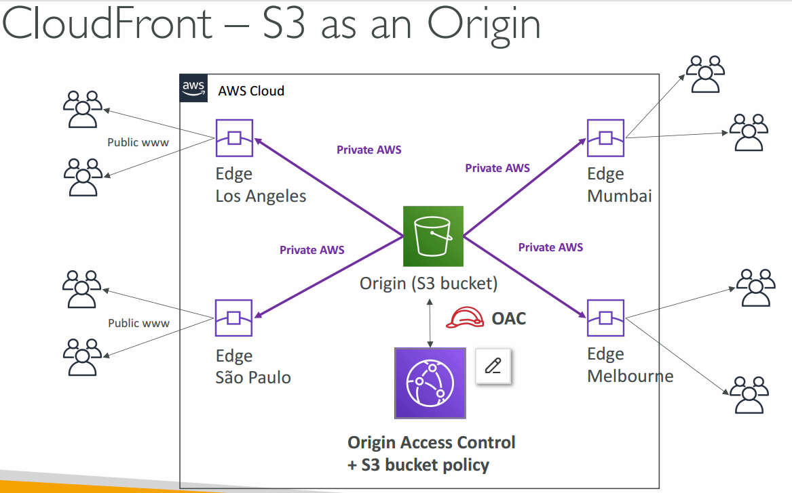

Amazon CloudFront speeds up distribution of your static and dynamic web content, such as .html, .css, .php, image, and media files. When users request your content, CloudFront delivers it through a worldwide network of edge locations that provide low latency and high performance

#### Documentations:
- https://docs.aws.amazon.com/cloudfront/
- https://docs.aws.amazon.com/AmazonCloudFront/latest/DeveloperGuide/Introduction.html

For the Cloudfront distributions we're building, S3 will serve as the origin of the files to be cached at edge locations.

cache invalidations == *manually* refreshing the cached
files/applications at edge locations to ingest new/updated
files/apps. Helps when making multiple updates to a given S3
bucket or other origin
- cloudfront automatically refreshes when the time to live (TTL) for a given file expires
 
 ### General build steps (per cloudFront developer guide link):
 1. build an s3 bucket
 2. upload files to your S3 bucket
 3. create a ClouldFront distribution CloudFront which aorigin servers to get your files from when users request the files
 4. when properly configured, CloudFront assigns a domain
 5. cloudfront sends the distribution config, but not the conten, to all the specified "points of presence" across the world
   
# Lab Build

### 1. Build an s3 bucket
- create and name bucket
- enable versioning
- everything else == default
- do not change anything regarding security  
  
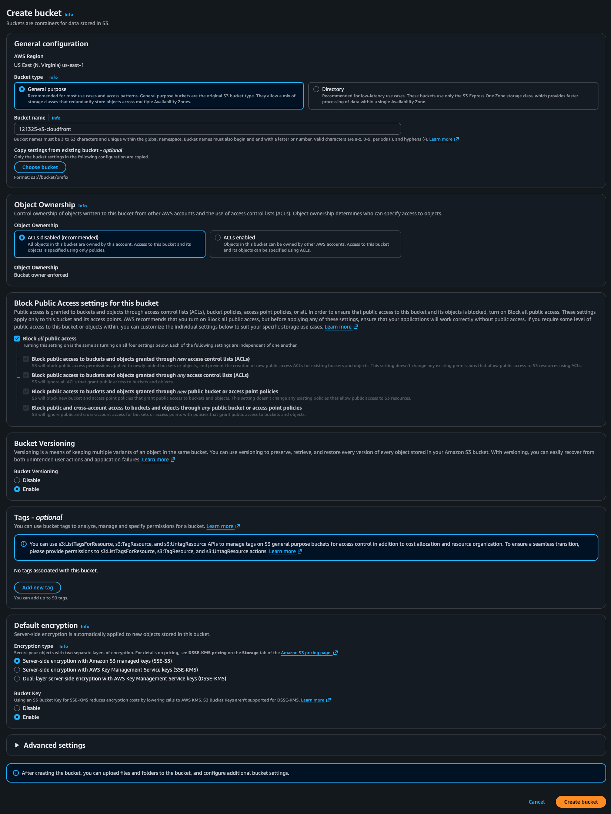

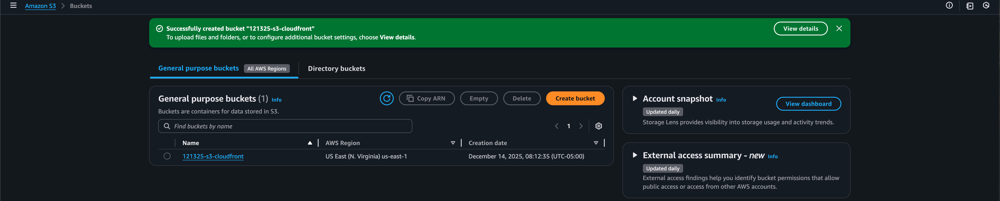

  
### 2. Upload files to s3 bucket
- go to s3 bucket > objects > upload
- drag, drop, check, and upload
- do not change anything regarding securtiy

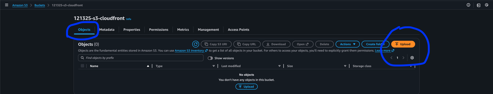

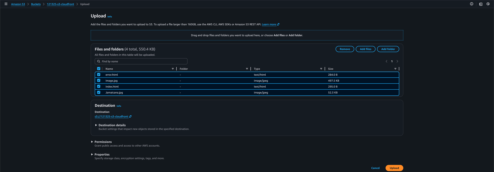

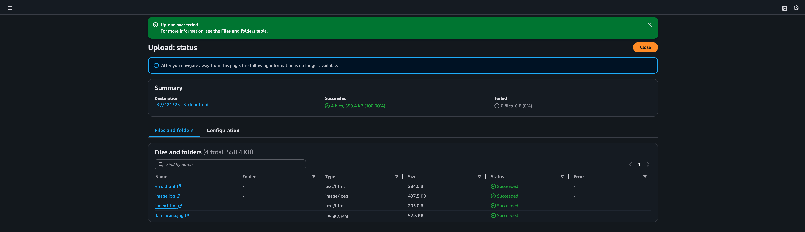
  
### 3. Build cloudfront distribution
- cloudfront will eventually pull files from the s3 bucket and deliver to specified locations
- *option select "pay as you go"so you can immediately destroy when done
- pg 1: of creation: name + describe distro, everything else is default
- click next
  
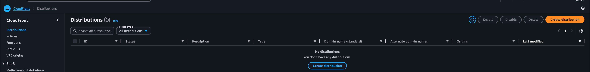

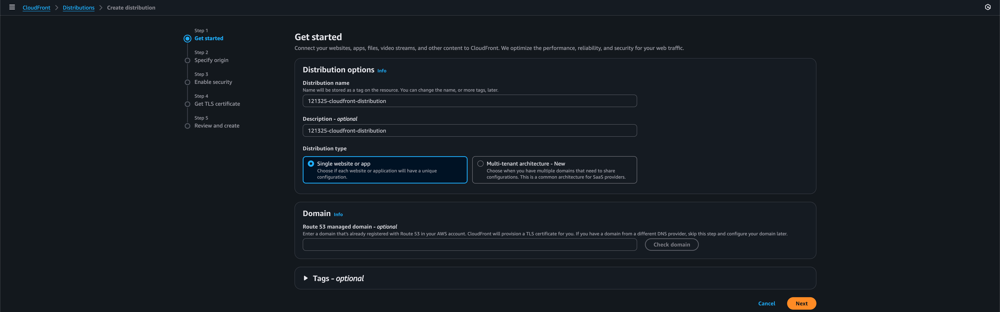

- pg 2: (specify origin): select desired s3 bucket for s3 origin
- click next

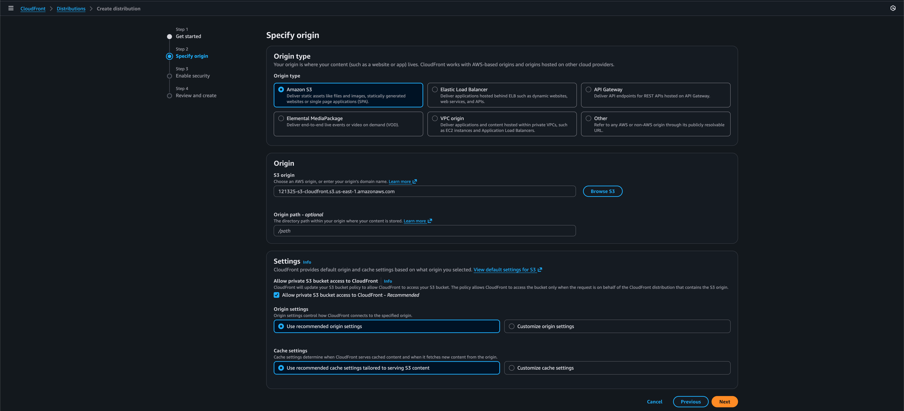

- pg 3: (WAF): everything left as default
- click next
  
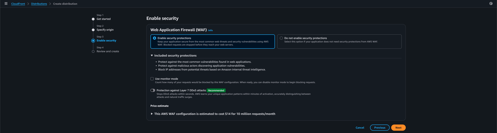

- pg 4: click create
  
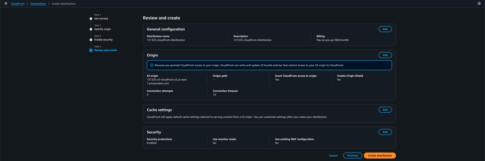

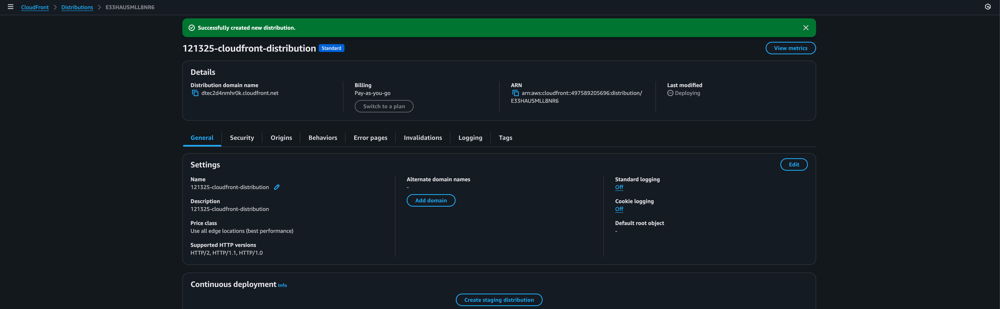

### 4. Customize CF distribution
#### Set up html page

- cloudfront > distribution > click on distribution ID name

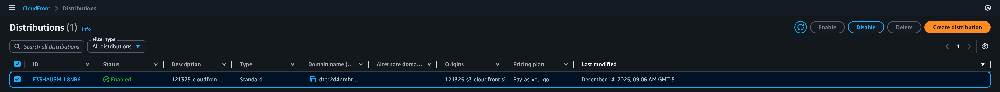

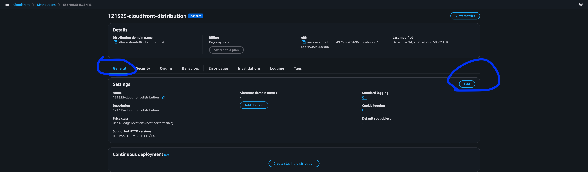

- General > settings > edit > General > "Default root object - optional" type the name of your file, *usually index.html
- save changes

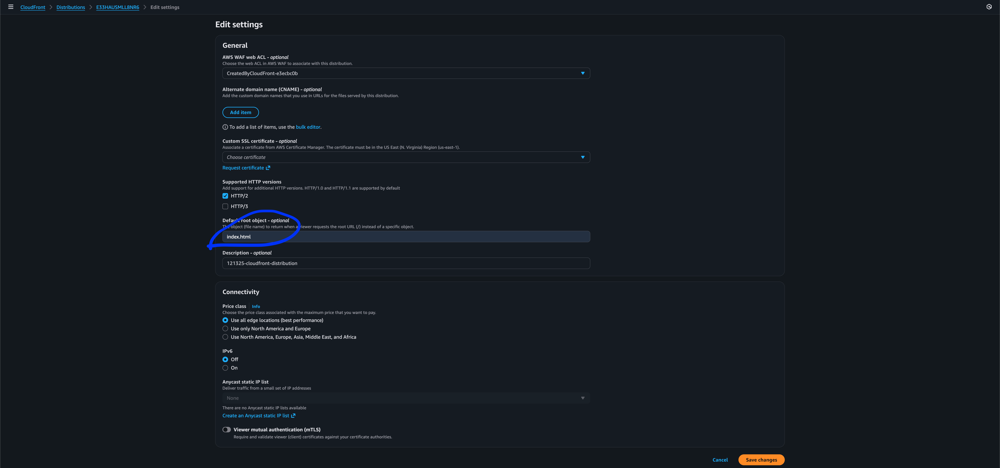

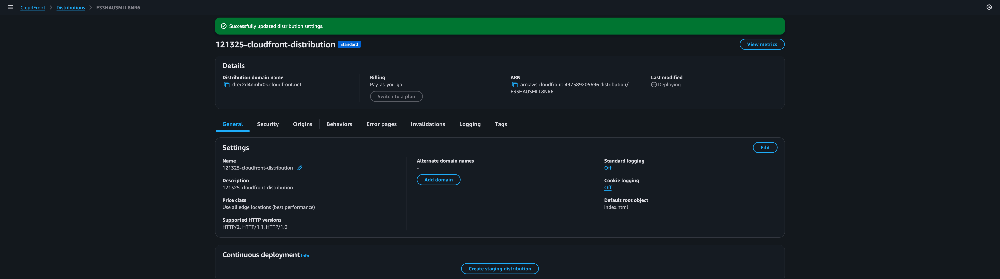

- *if default root object not set, you'll get an "access denied" error message when accessing distro

#### Set up error page
- cloudfront > distribution > click on distribution ID name > Error pages > Create custom error response

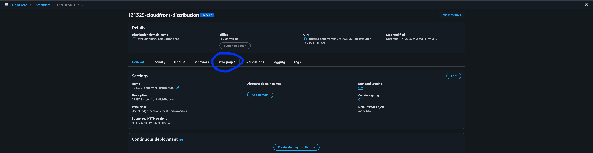

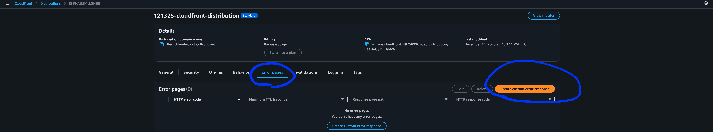

- create custom error response > error code 404 > click yes to customize error response > response page path == /<file name> (e.g. /error.html)
- html response code is same as one entered before (error code 404)

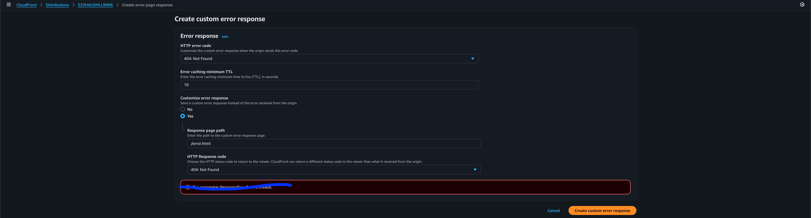

- click Create custom error response

- if a newer version of files were added to the origin, create an invalidation to purge the CF cache of old versions (invalidations > create invalidations > specify object paths for invalidations) [e.g. /lizzo.html] > create invalidation

### 5. Provide CloudFront distribution domain name (aka link)
- copy distribution domain name from "details", then paste in browser to test

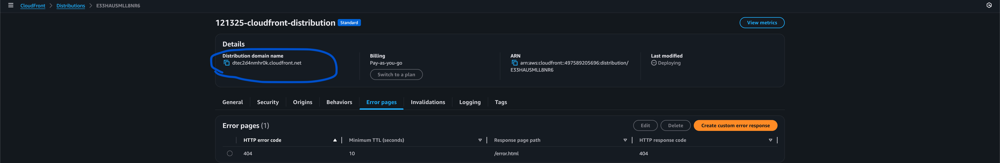

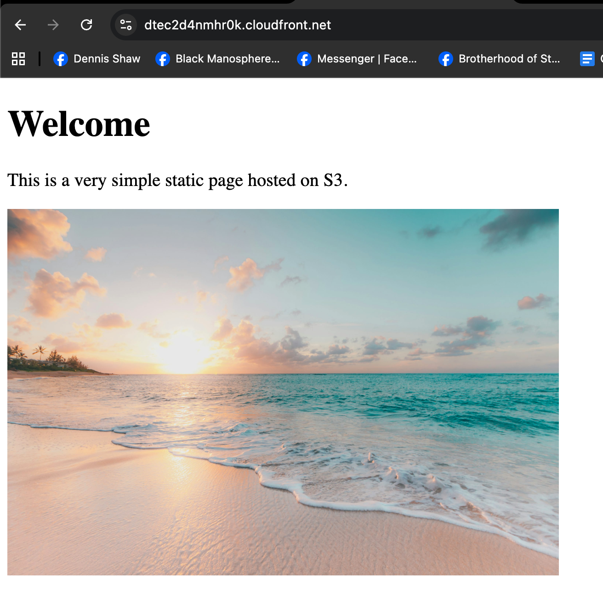

- testing error.html document by adding /error.html to the end of the distribution domain name ==  <CF distribution name>/error.html

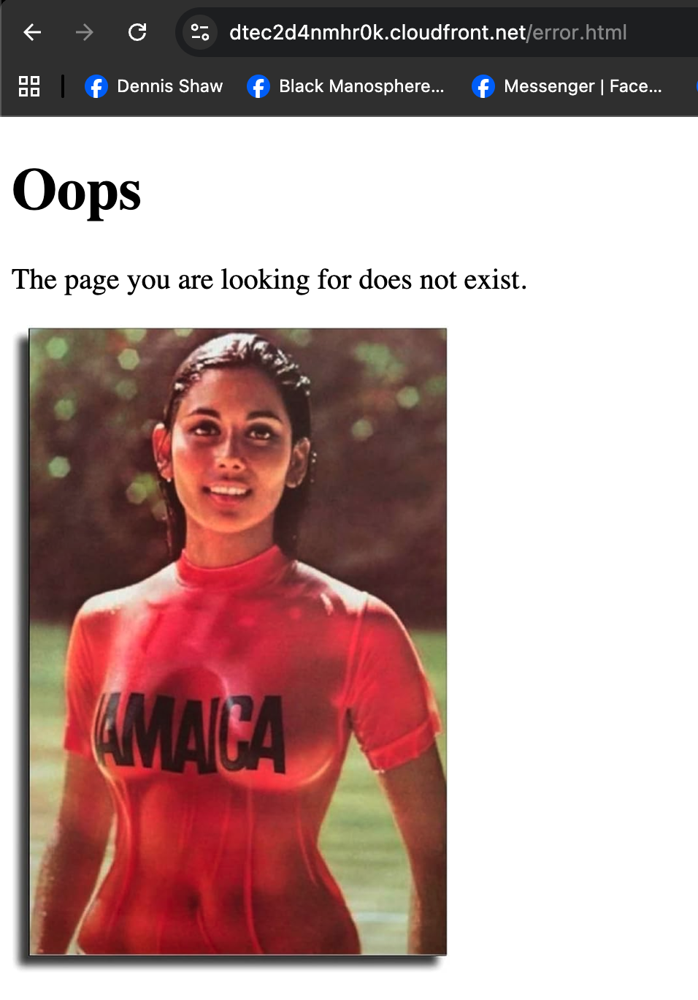

### 6. Teardown
1. CloudFront > disable distribution
2. Amazon S3 > Buckets > delete bucket > empty bucket > delete bucket

