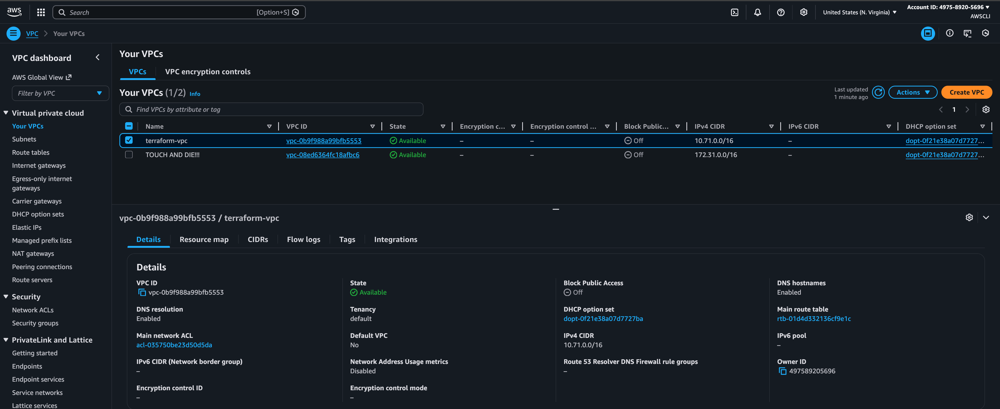
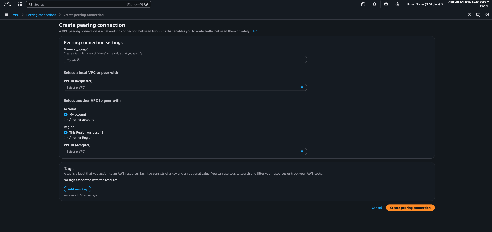
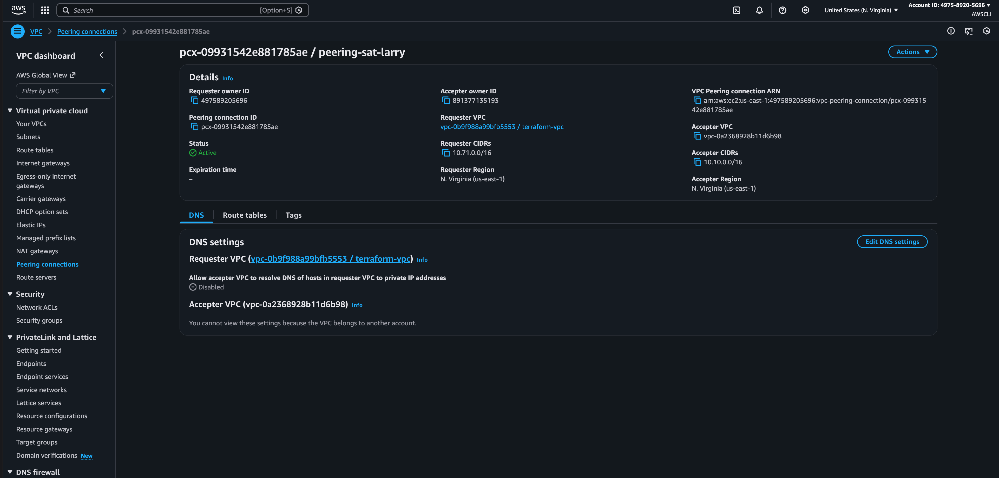
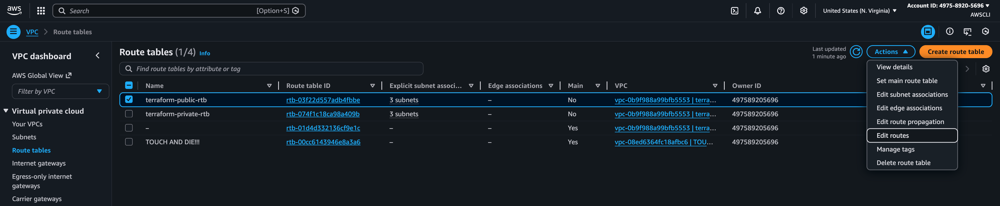
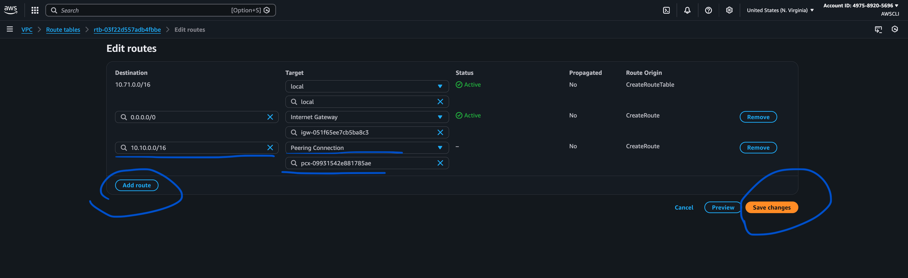
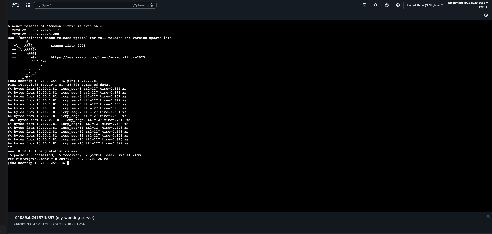

# Class7 - Saturday (12-28-25)
### Teacher: Theo/Rob/Aaron
### Topic: Talking about upcomming Armageddon project

Sample links: 
- [Class 6 Armegeddon](https://docs.aws.amazon.com/vpc/latest/peering/what-is-vpc-peering.html)

- [Architecture diagram](https://external-content.duckduckgo.com/iu/?u=https%3A%2F%2Fmiro.medium.com%2Fmax%2F1062%2F1*Abu4eeFODEkdG7hXwvb5dg.png&f=1&nofb=1&ipt=7a1f3fb1edeba45a736098c566b5d98f9ef444bedcfbb1b72ed9d24c30e9e453)

----------------------------------------------------
# What is VPC Peering?
- VPC Peering is a networking connection between two VPCs that allows them to communicate as if they were part of the same network. This connection is bidirectional and allows for a private and secure exchange of traffic without the need for internet gateways, VPNs, or additional bandwidth costs.

For Best Practices: 
- Use Tags for Easy Management: Name and tag your VPC peering connections for easier tracking.
- Minimise the Number of Peering Connections: VPC Peering is point-to-point, meaning if you have many VPCs that need to communicate, a mesh of peering connections may become complex. Consider using AWS Transit Gateway if you expect a large number of inter-VPC connections.

- important security strategy to know: [Zero Trust](https://learn.microsoft.com/en-us/security/zero-trust/zero-trust-overview)

### Prerequisites
Before starting the setup, ensure you have the following:

- Two VPCs that don’t have overlapping CIDR blocks. VPC Peering does not support communication between VPCs with overlapping IP ranges.
- Appropriate permissions in IAM to create VPC Peering connections.
- VPC route tables configured to allow traffic between the VPCs.

----------------------------------------------------

### VPC Peering Documentation

----------------------------------------------------
### How to Set Up VPC Peering in AWS: A Step-by-Step Guide  
https://medium.com/@deepakbajaj20/how-to-set-up-vpc-peering-in-aws-a-step-by-step-guide-a009201ac421

### 1. Build up a vpc and the associated trimmings in your preferred region
- personal note: for this lab only build up to the 07-EC2.tf (11-18-25_wk11) don't use the launch-template.tf version 
  

### 2. Identify the VPCs to Peer
You must plan; you need to choose a human being for your partner
What you are looking for from each individual to do peering documentation
- make sure you don't have overlapping CIDR
>>- my name: AWSCLI
>>- my AWS account ID:
>>- my VPC name:
>>- My VPC ID (for peering): 
>>- My VPC region (for peering):

--Select another student's VPC to peer with--

>>- partner's name: 
>>- partner's AWS account ID:
>>- partner's VPC name: 
>>- partner's VPC ID:
>>- partner's VPC region:
  
Downloadable .txt file; fill it out and send it to your peer: [VPC Peering Documentation](./AWS_vpnplanningdoc.txt)
  
### 3. Create a VPC peering connection
- go to the AWS council and Create Peer Connection
- use a descriptive name
- select VPC A (the initiator of the request) or VPC B (the receiver)
- if the VPC is in another region, input the Account ID na dregion details of the acceptor VPC
- Submit the Peering Request
Once filled in, click Create Peering Connection. The connection request is now pending and must be accepted by the other VPC.

### 4. Accept the VPC Peering Connection
- go to Peering Connections and you will see pending connection is someone has initiated a request to you or you have sent the request to someone and must wait for them to accept request
  

### 5. Update Route Tables
For the two VPCs to communicate, you must update their route tables to allow traffic to flow through the peering connection. Navigate to Route Tables  

- Click Routes > Edit Routes > Add Route.
- For Destination, enter the CIDR block of VPC B (ie. 10.1.0.0/16).
- For Target, choose the Peering Connection ID created earlier.  

Update the Route for VPC B
- Repeat the same steps for VPC B:
- Destination: Enter the CIDR block of VPC A (10.0.0.0/16).
- Target: Use the Peering Connection ID.
  

### 6. Update Security Groups
Both VPCs have their own security groups, which act as firewalls for controlling traffic. To ensure proper communication, you need to update security group rules to allow traffic from the peered VPC.

Modify Rules for VPC A  

- go to security group
- Select the security group associated with your instances in VPC A.
- Add inbound rules that allow traffic from the CIDR block of VPC B.
- Repeat for outbound rules if necessary  
  
Modify Rules for VPC B

- Similarly, modify the security groups for VPC B to allow traffic from VPC A.

### 7. Verifying peering connection
- go to ec2 instance connect to my instance and ping get the peering partners IP and ping it and visa versa
  

### Troubleshooting
- Route Table Issues: If the instances in the peered VPCs cannot communicate, check if the correct routes have been added to the route tables in both VPCs.
- Security Group Restrictions: Ensure that security groups on both sides allow inbound and outbound traffic from the peered VPC CIDR range.
- Network ACLs: If you are using network ACLs, make sure they are not blocking traffic between the two VPCs.
  
### Conclusion
Setting up VPC Peering is a powerful tool for securely connecting different VPCs within AWS or across regions. It enables the sharing of resources like databases or micro services between isolated networks while maintaining high security and control over traffic flow.